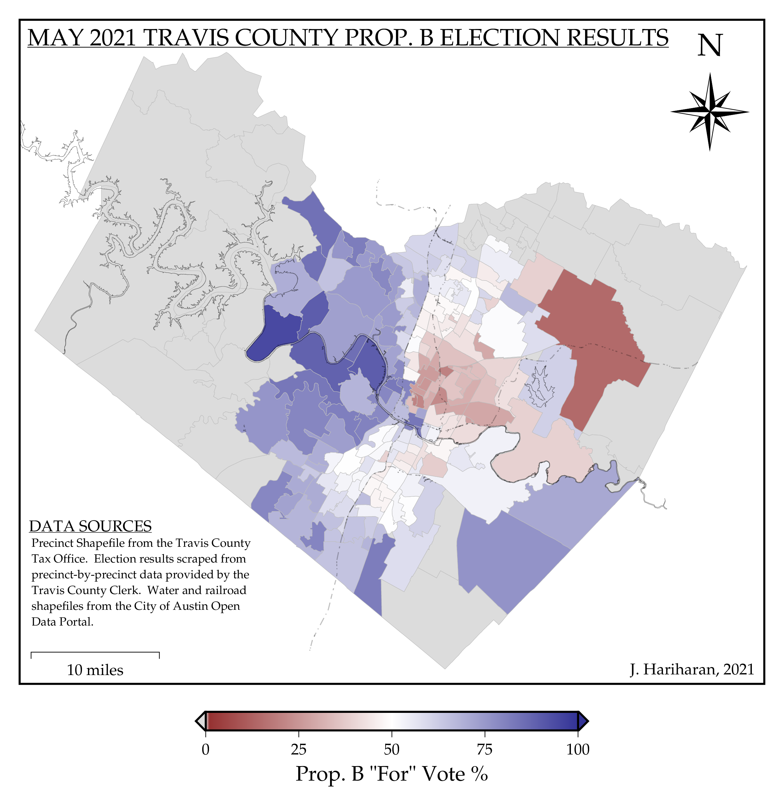
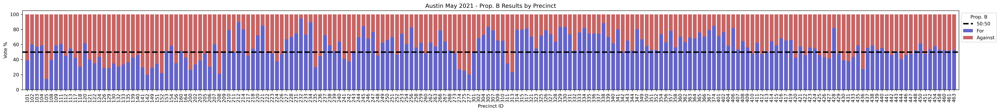

# ATX_PropB_Map
Semi-automated workflow to create a map of precinct-by-precinct election results for Austin, TX



This repository provides the source code necessary to reproduce the map shown above. Technical step-by-step instructions required to reproduce this map are provided below, for a more qualitative explanation of the map and project see [this page](https://jayaramhariharan.com/).

## Data Sources
Data for this project comes from a variety of Travis County and City of Austin resources.

- The original Travis County precinct shapefile was obtained from the [Travis County Tax Office](https://tax-office.traviscountytx.gov/about-us/reports-data/voters), the provided [TECP_reprojected_mod.shp](TECP_reprojected_mod.shp) shapefile has been re-projected to a more common projection so that it works better with GMT
- Unofficial local election results were obtained from the [Travis County Clerk](https://countyclerk.traviscountytx.gov/elections/election-results-1/results-for-may-01-2021-local-elections.html)
- Miscellaneous GIS data from the [City of Austin Open Data Portal](https://data.austintexas.gov/), more information on this GIS data as it can be used in this project is available [here](misc_gis/README.md)

## Software and Packages Required
The Python processing requires the following libraries (also in [requirements.txt](requirements.txt)):

- `numpy`
- `pandas`
- `matplotlib`
- `tabula`
- `geopandas`

Generating the map itself requires [GMT](https://www.generic-mapping-tools.org/) (I used GMT 6.0.0).
Within the GMT script, [GDAL](https://gdal.org/) and [ghostscript](https://ghostscript.com/) are used. 
Post-processing to go from an output PDF to a `.png` image was done with [ImageMagick](https://imagemagick.org/index.php).

## Workflow
- [Scrape the Election Results PDF](#scrape-the-election-results-pdf)
- [Associate Scraped Data to Geographical Data](#associate-scraped-data-to-geographical-data)
- [Create the Map with GMT](#create-the-map-with-gmt)
- [Post-Process to an image](#post-process-to-an-image)

### Scrape the Election Results PDF 
Latest vote counts on a precinct-by-precinct basis can be obtained from the [Travis County Clerk](https://countyclerk.traviscountytx.gov/elections/election-results-1/results-for-may-01-2021-local-elections.html).
The scraping procedure is in a single Python script that can be run with the command `python scrape_script.py`. 

In addition to extracting the Prop. B "For" vote percentages and placing them in a CSV file, `ScrapedResults_PropB_prePrecinct.csv`, the below plot is also generated showing the vote split for each precinct as a series of stacked bars.


Not terribly legible due to the sheer number of precincts, but if viewed separately you can zoom in and read individual labels if you so choose.
The Python scraping script uses the `tabula` package to coerce information from the election information PDF into a messy `pandas` DataFrame.
From this DataFrame, we can identify the precinct ID associated with each PDF page, and we can search for and identify Prop. B results on each page.
By linking precinct IDs to corresponding Prop. B voting results, a new DataFrame is created, and this is exported as a new CSV file called `ScrapedResults_PropB_prePrecinct.csv.`.

**IMPORTANT:** The PDF document is 700+ pages in length making automated data scraping attractive. However while this method is expedient it is not guaranteed to be accurate or work perfectly. We assume that the format of the pages remains consistent throughout the document and hope the method works. 

### Associate Scraped Data to Geographical Data
To associate the scraped data to geographical information that is ultimately plotted on the map, there is a single Python script that can be called after scraping the data: `python manipulate_shapefile.py`. 

This script uses `geopandas` to associate the scraped data about Prop. B vote results per-precinct to the precincts shapefile.
Effectively we check each precinct ID in the original precincts shapefile, and if we have an associated entry in the scraped data for that precinct, we "link" it to the precinct shapefile as an *attribute*. 
The output of the `manipulate_shapefile.py` script is a new shapefile called `PropB_For.shp` which contains the same precinct geographical information with a new attribute "For" that contains the % of the vote that was in favor of Prop. B for that precinct. 

### Create the Map with GMT
The mapmaking script is a bash shell script called `shaded_map_for_vote.sh` which uses GMT to make a PDF map.

This script converts the `PropB_For.shp` into a `PropB_For.gmt` GMT-compatible file using the `ogr2ogr` [GDAL](https://gdal.org/) command.
Then a bunch of GMT commands are used to create the visual components of the final map. 
Polygons in the precinct shapefile with no identified Prop. B vote information from the PDF scraping are colored gray in the final map.
Lastly the GMT script converts the output PostScript file into a PDF file using [ghostscript](https://ghostscript.com/).

`shaded_map_for_vote.sh` contains commented-out lines which can optionally use additional shapefiles available from [City of Austin Open Data Portal](https://data.austintexas.gov/) to display information such as lakes, rivers, roads, and railroads on the map.
To incorporate that additional data, add them to the [misc_gis](misc_gis/README.md) subdirectory.
The example map displayed at the top shows both water features and railroads lines.

**NOTE:** I use a Unix-based OS, running this script on another operating system may require modifying the line-endings ([Newline Wikipedia Page](https://en.wikipedia.org/wiki/Newline)).


### Post-Process to an image
To post-process the output PDF into a `.png` image file, I used the following [ImageMagick](https://imagemagick.org/index.php) CLI command:
```
convert -density 300 plot_shaded.pdf -flatten plot_shaded.png
```
